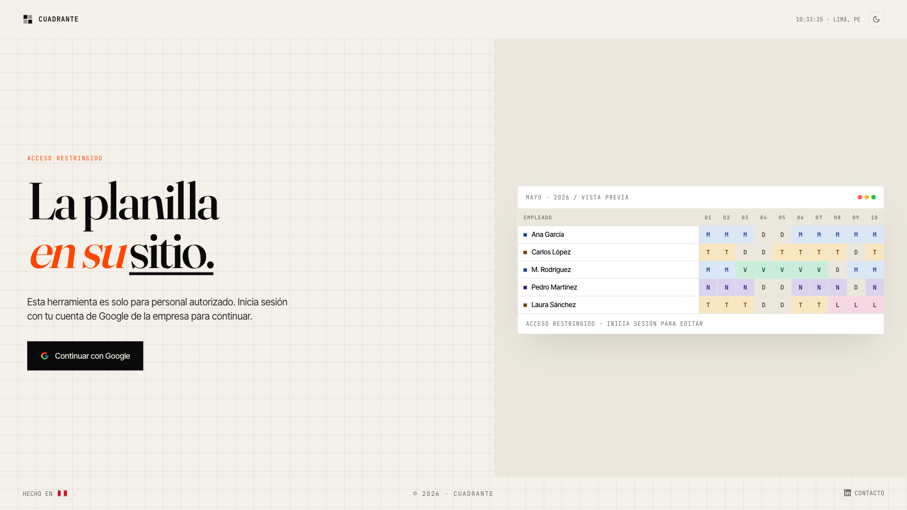
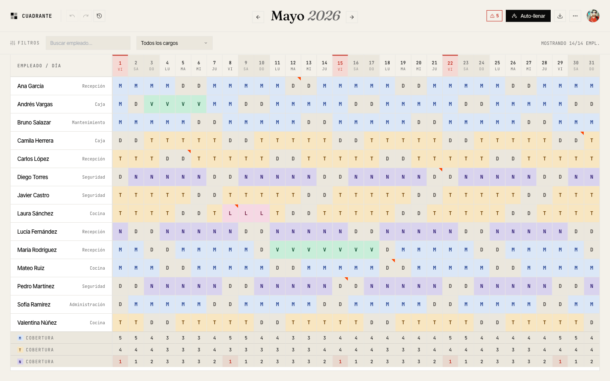

# Cuadrante

**Monthly shift roster for teams with rotating staff.**

An internal tool to plan the month's guards in less time and with fewer errors. Cuadrante is for the administrator who today opens Excel at the end of each month, paints cells with colors, tries not to break the rules (post-night rest, max 6 days in a row, minimum coverage per shift, pending vacations…) and ends up emailing a PDF to the team.



---

## What you can do

### Plan the month
- **Monthly grid view** with every employee, all 31 days, and the M/T/N coverage row at the table foot.
- **Quick assignment**: click a cell and pick a shift, or drag to paint a range. Keyboard shortcuts (`M`, `T`, `N`, `V`, `L`, `D`) over a selection.
- **Auto-fill**: completes empty days while respecting the active rules (base rotation, rest periods, minimum coverage).
- **Copy month**: replicate the assignments of a previous month with a couple of clicks.
- **Cell notes** (right-click) and **day notes** (header click) to record incidents, trainings, visits, etc.

### Validate in real time
- Extensible rules engine: post-night rest, maximum consecutive days, minimum M/T/N coverage, etc.
- Violations are flagged **on the cell** and listed in the **side panel** with an explanatory tooltip.
- Rules are editable from the UI (toggle, tweak parameters) — changes persist per user.

### Employees & holidays
- Add, edit, archive and delete employees, with role, base shift, avatar color and vacation balance.
- Mark local holidays on top of the Peruvian national ones (pre-loaded).
- Filter by role and search by name.

### Print & export
- **Monthly A4 landscape view** with footnotes and holidays explained.
- **Annual PDF** (12 pages, one per month).
- **Individual schedules** (one page per employee with a weekly calendar, legend, total hours and notes).
- **Excel** with styled shifts + **CSV** without styles.
- **Import Excel** from another source, mapping employees by name.

### Audit & undo
- **Undo/Redo** with `⌘Z` / `⌘⇧Z` (Mac) or `Ctrl+Z` / `Ctrl+Shift+Z` (Windows). 50-step stack.
- **Persistent change history**: every action is recorded in a `change_log` table (what changed, by whom, when). Visible from the history button in the header.

### Privacy
- **Per-user**: every account has its own private company. Row Level Security (RLS) in Postgres ensures no user can see another's data, even with raw queries against the backend.
- **Allowlist**: only pre-authorized emails can sign up. The list lives in an `allowed_emails` table managed via SQL/migrations.

---

## Screenshots

### Login
The sign-in screen with a live preview of the roster.


### Cuadrante in use
The main view with 14 employees, rotating assignments, vacations (green), medical license (pink), cell notes (red triangle), and M/T/N coverage rows always visible while scrolling.



---

## Tech stack

| Layer | Technology |
|---|---|
| Frontend | Vite + React 18 + TypeScript |
| State | Zustand (no persist — Supabase is the source of truth) |
| Backend | Supabase Postgres + Auth (no in-house backend) |
| Authentication | Google OAuth via Supabase Auth |
| Authorization | Row Level Security (RLS) gated by `auth.uid()` + `allowed_emails` table |
| Export | `xlsx-js-style` (lazy-loaded via dynamic import) |
| Deploy | GitHub Pages + GitHub Actions |

### Architecture decisions

**No in-house backend.** The frontend talks directly to Supabase using the anon key (public). Real security comes from the RLS policies — every table has `owner_id` and the policies enforce `using (owner_id = auth.uid())`. No user can read or write another user's data.

**Optimistic UI.** Mutations (`setCell`, `addEmployee`, etc.) are applied locally synchronously and then sent to Supabase in the background. If it fails, an error toast pops up. The UI never blocks on the network.

**Per-user multi-tenant.** Every authorized account has its own private roster. Migration `20260512152015_per_user_isolation.sql` added `owner_id uuid DEFAULT auth.uid()` to every data table.

**Print without libraries.** PDFs are generated with `window.print()` + CSS `@media print` and React components conditionally portaled to `<body>`. Zero dependency on jsPDF / puppeteer.

**Aggressive code splitting.** `xlsx-js-style` (~600KB) is the heavy dependency and is only loaded when the user actually exports to Excel. The initial bundle is ~118KB JS + 207KB Supabase + 141KB React (gzipped: ~130KB).

---

## Running locally

Requirements: Node 20+, a Supabase account (you can use the project's or create your own).

```bash
git clone https://github.com/RayverAimar/cuadrante.git
cd cuadrante
npm install
```

Create `.env.local` at the root:

```env
VITE_SUPABASE_URL=https://<your-project>.supabase.co
VITE_SUPABASE_ANON_KEY=<your-anon-key>
```

(The anon key is public — it ships in the client bundle. Security comes from RLS.)

```bash
npm run dev
```

Open [http://localhost:5173/cuadrante/](http://localhost:5173/cuadrante/) (note the subpath — it matches the GitHub Pages base).

---

## Project structure

```
src/
├── App.tsx                       # Auth gate + initial load
├── lib/
│   ├── supabase.ts               # Supabase client
│   ├── supabase-types.ts         # Generated types (do not edit by hand)
│   └── useAuth.ts                # Session hook
├── store/
│   ├── useRosterStore.ts         # Global state + mutators + change_log
│   └── useToastStore.ts          # Error notifications
├── rules/index.ts                # Rules engine + default rules
├── types/index.ts                # Domain types
├── constants/shifts.ts           # M/T/N/V/L/D shift definitions
├── components/
│   ├── Cuadrante.tsx             # Main view
│   ├── Login.tsx                 # Sign-in screen
│   ├── cuadrante/
│   │   ├── TopBar.tsx            # Header with undo/redo/history/export
│   │   ├── FilterBar.tsx         # Search + role filter
│   │   ├── RosterGrid.tsx        # Monthly table with sticky headers + scroll
│   │   ├── SidePanel.tsx         # Side panel (drawer) with validation
│   │   ├── SelectionActionBar.tsx # Actions on cell selection
│   │   └── print/                # Print-only components (portaled)
│   ├── modals/                   # Employees, Rules, Help, History, …
│   └── ui/                       # Primitives: Modal, Tooltip, Select, Toasts, Icon
├── utils/
│   ├── date.ts                   # getDaysInMonth, isWeekend, dowOf, …
│   ├── autoFill.ts               # Auto-fill algorithm respecting rules
│   ├── copyMonth.ts              # Selective copy between months
│   └── export.ts                 # CSV, XLSX, annual, import
└── data/holidays.ts              # Peruvian national holidays

supabase/
└── migrations/                   # Versioned SQL
    ├── 20260511222953_init_schema.sql
    ├── 20260512150950_add_change_log.sql
    ├── 20260512152015_per_user_isolation.sql
    └── 20260512153047_seed_demo_data.sql
```

---

## Adding a new rule

Rules live in `src/rules/index.ts`. Add an object to `DEFAULT_RULES` and the UI picks it up automatically:

```ts
{
  id: 'my_rule',
  name: 'No more than 2 nights in a row',
  description: 'Limits the number of consecutive N shifts per employee.',
  enabled: true,
  value: 2,
  validate({ employees, assignments, dim, value }): RuleIssue[] {
    const issues: RuleIssue[] = []
    // ...violation detection...
    return issues
  },
}
```

The rules engine, side panel, in-cell marker and header pill count all react without any other changes.

---

## DB migrations

```bash
# 1. create empty .sql file with timestamp
supabase migration new <descriptive_name>

# 2. edit supabase/migrations/<timestamp>_<name>.sql with the SQL

# 3. apply to remote
supabase db push

# 4. regenerate TS types (if the schema changed)
supabase gen types typescript --linked 2>/dev/null \
  | grep -v "^Initialising\|^$" > src/lib/supabase-types.ts
```

**Rule:** never edit a migration that has already been applied. Create a new one.

---

## Adding a new user

Every authorized email lives in the `allowed_emails` table. To add or remove:

```bash
supabase migration new add_user_<name>
```

```sql
insert into allowed_emails (email) values ('new@company.com')
on conflict (email) do nothing;
```

When the user signs in for the first time, they'll see an empty roster. Their data is private; RLS isolates it.

---

## Deployment

GitHub Actions runs on every push to `master` and publishes to GitHub Pages. The workflow lives in `.github/workflows/deploy.yml`.

Two repo secrets are required (`Settings → Secrets → Actions`):

- `VITE_SUPABASE_URL`
- `VITE_SUPABASE_ANON_KEY`

And `Settings → Pages → Source: GitHub Actions`.

---

## To do

- Auto-fill tests with Vitest (determinism, hard-rule enforcement)
- Realtime sync (multiple admins editing the same roster — doesn't apply with the current per-user model, but useful if it becomes multi-org)
- "Compact" grid view for >30 employees

---

## License

Internal use. Built in Peru 🇵🇪.

Contact: [LinkedIn — Ray Emece](https://www.linkedin.com/in/ray-emece).
